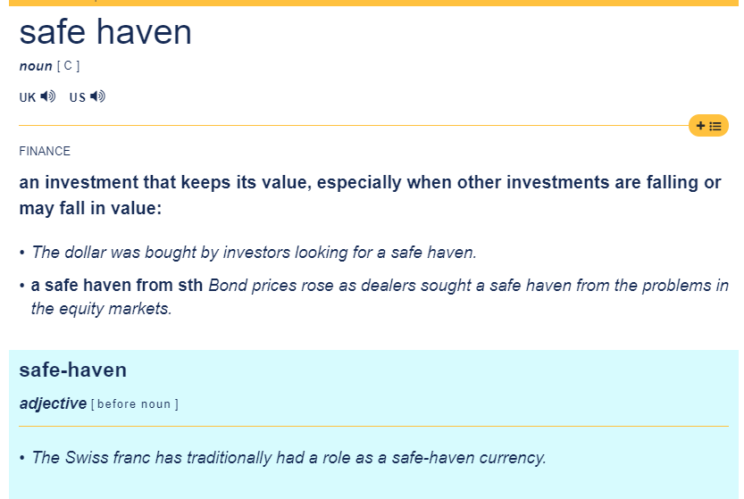
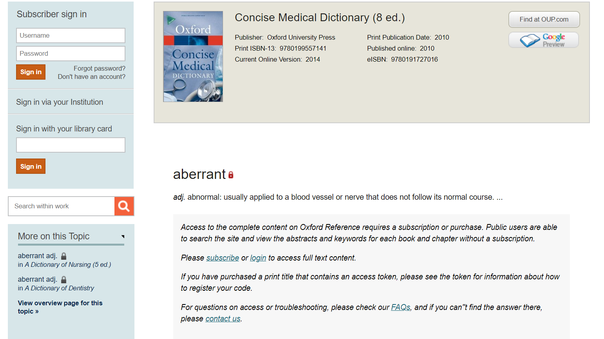
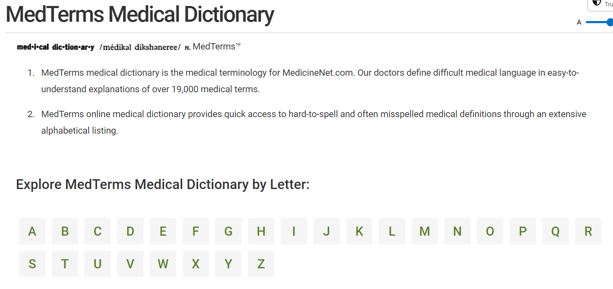
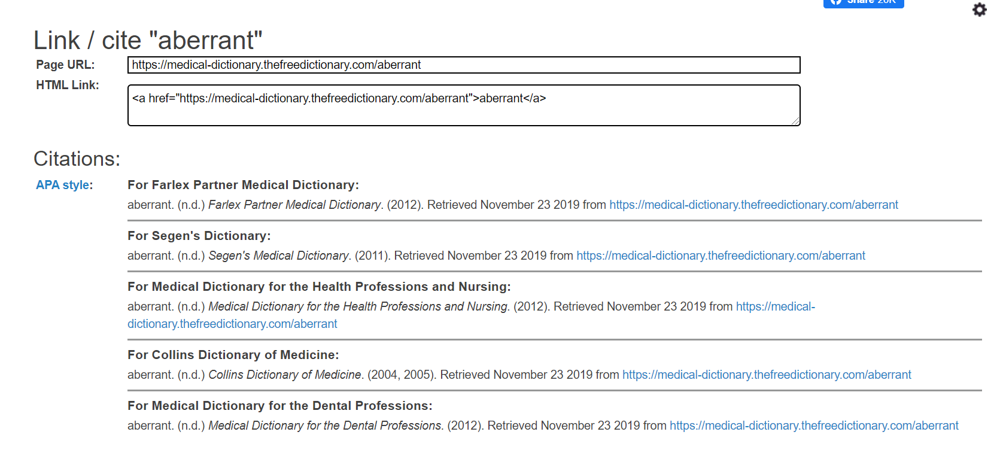
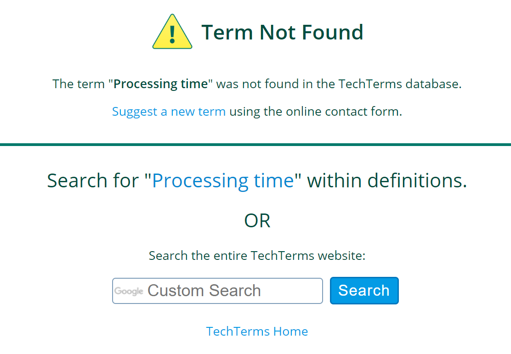
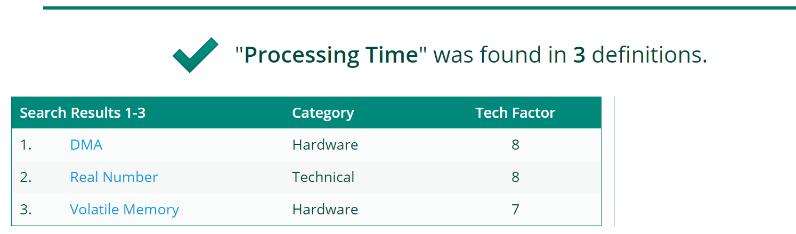
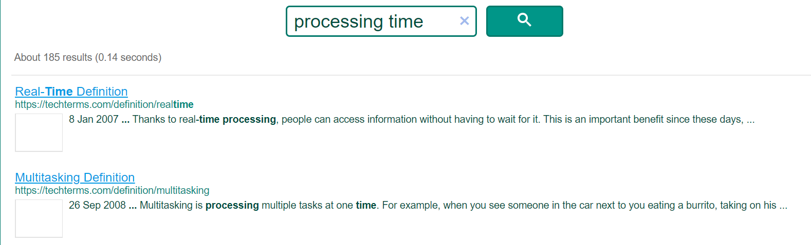

## 专业词典
### 金融方向

中文：
- 经管百科：http://wiki.pinggu.org/
  
    原人大经济论坛，是国内活跃的经管人士的网络社区平台。收录的术语词汇是众包的，为单语词汇解释。会显示贡献榜，创建账号即可添加词条。

    优点：免费

    缺点：单语；众包质量无法保证

- SCIdict：www.scidict.org/

  
    专为学术研究人员以及技术专家设计的中英专业术语搜索词典,致力于为细分专业领域的翻译提供参照,并同时促进各行各业人士的专业英语学习进阶。其中包括科学、生物医学、己写、化学、信息科学、商业、人文几个领域。

    会将搜索到的所有词汇返回给使用者，使用者可以通过箭头链接跳转到相关词条查看。

    优点：双语；集成多个领域

    缺点：收费，一年269元；词条质量无法保证，搜索时出现过直译现象。

国外：

- 投资百科 investopedia：https://www.investopedia.com/financial-term-dictionary-4769738

    1999年创立的美国网站，专注投资金融教育。网站有投资、教育、市场、金融咨询、字典等几个板块。字典板块可以查询金融词汇，通过字母索引检索。同时会在字典首页推送金融方向的每日1词。每个词条除了解释还会包括如何理解、词汇辨析、局限性、举例等等内容，为使用者带来很大便利。

    优点：免费；词条全面；解释详细；界面清晰；较权威

    缺点：并没有找到如何添加词条的途径

- Herold Financial Dictionary ：https://www.financial-dictionary.info/
  
  Herald金融在线词典，拥有Accounting, Banking, Corporate Finance, Economics, Investments Laws & Regulations, Real Estate, Retirement, Trading几个板块，此外可通过字母索引进行搜索，或者直接查看所有词条。另外，还可以检索英文简写，例如：ARM--Adjustable Rate Mortgage

  Herald Dictionary 同时拥有纸质版本，分为Basic Edition, Accounting, Banking, Corporate Finance, Economics, Investments, Laws&Regulations, Real Estate, Retirement, Trading几本，可以在亚马逊购买。

  优点：免费；界面简洁清晰；索引清晰；词条解释详细

  缺点：词条较少；主要还是一个纸质版本的节选

- 牛津金融与银行词典 Dictionary of Finance and Banking：https://www.oxfordreference.com/view/10.1093/acref/9780199229741.001.0001/acref-9780199229741
  
    纸质版牛津金融与银行词典的线上版本，以字母索引。

    优点：老牌权威；索引清晰；收录多，条目全；

    缺点：收费，需要订阅
![6]https://github.com/CATatPKU/Dictionary_research/blob/master/image/clule/6.PNG)

- Investing Answers https://investinganswers.com/financial-dictionary

    一个金融咨询网站，提供金融方面的服务。但同时也提供投资、贷款、信用卡、抵押、银行、保险等相关的术语词汇解释。同时可以看出每一个标题下包含多少个条目。

    优点：免费；权威性较高；集成多个领域；界面清晰；搜索结果清晰、有自己的逻辑，还有举例说明
![7]https://github.com/CATatPKU/Dictionary_research/blob/master/image/clule/7.PNG)

    缺点：条目仅仅按字母罗列，不便于搜索

- wall street oasis： https://www.wallstreetoasis.com/finance-dictionary

    WSO是一个全球的金融社区，共参与者交流、提供服务。网站自称“ hope to be one of the most comprehensive financial dictionaries on the web”现收录400多条金融、贸易、投资相关词汇。使用者可以通过发邮件向网站管理者请求即使更新条目。字母索引方式排列。

    优点：免费；专人筛选，权威性高；搜索结果会推荐县官条目
    
    缺点：条目内容较为简短；实际内容收录并不是很多

- http://www.finance-glossary.com/
  
  一个简单的金融词汇平台，只能根据字母索引和搜索框查询。用户可以通过填写自己的专业和想增加的内容进行申请。

  优点：简介，直奔主题
  
  缺点：条目少，解释简短，仅仅使用原始的表格形式维护。

**纸质词典**

1. 巴伦商业词典 Barron's Business Dictionaries
- Dictionary of Business and Economics Terms
- Dictionary of Real Estate Terms
- Dictionary of Accounting Terms 
- Dictionary of Banking Terms
- Dictionary of Finance and Investment Terms
- Dictionary of Insurance Terms 
  

1. 高盛银行财经词典
2. 英汉路透金融词典

举例：
“We are seeing _safe-haven_ demand rise at the same time as risk assets look well supported. The risk-on, risk-off pendulum is broken, or at least is swinging to a different beat. ”
——https://www.investorschronicle.co.uk/risk/2019/07/18/finding-safe-haven/

safe haven其实是一个比较常用的金融词汇，一般词典都能查到，在这里比较一下区别，比如说在剑桥词典中：

很清晰解释了这个词的涵义，就是在其他投资贬值的时候买的用来保值的东西。
但对比investopedia专业词典的解释

拥有What is a Safe Haven?Understanding Safe Havens；Examples of Safe Havens；Safe Haven Currencies；Considerations When Searching for Safe Havens 好几个模块。

### 法律方向

国内：

- 元照英美法词典-app，可以在欧陆词典中下载使用：English-Chinese Dictionary of Anglo-American Law

    集成潘汉典教授等学者组织编写法律出版社出版的《元照英美法辞典》纸质版。编译者权威，同游5万余词条。词条注明了词源和用法

    优点：双语；专家修订、权威；词条丰富；英到中解释全面

    缺点：英到中解释详细，但相比中到英翻译解释太短，一般只有词的翻译

- 布莱克法律大辞典-app：https://thelawdictionary.org/
    这个网站并不是官方网站，但基于布莱克法律大辞典第二版（由于其版权已经过期，可以公共访问），但使用者可以通过联系管理人员申请增加词条。现在收录30000条以上相关词汇。

    优点：权威性高；拥有移动版本；搜索结果包含词条来源

    缺点：界面不清晰，入口难找，搜索框在最下；词条解释较短

- 韦氏法律词典： https://www.merriam-webster.com/legal

    收录超过10000个法律词汇，拥有清晰、简洁的解释，词条由韦氏词典编撰的专业人士筛选。此外，韦氏词典的网页版会根据查询词汇的不同有各种链出，例如：比较相似词汇、像韦氏其他词典链接以获得更详细解释，方便用户对查询词汇更深的理解。

    优点：免费；界面简洁，并可以同时看到在普通韦氏词典中的词条解释；词条全面；老牌权威；每个词不同的相关链接

    缺点：每个词条的解释较少

- 牛津法律词典：https://www.oxfordreference.com/view/10.1093/acref/9780199551248.001.0001/acref-9780199551248
  
  牛津法律网络词典2013修订版，收录了4200个法律词条。被誉为the best law dictionary’ and ‘excellent for non-law students as well as law undergraduates’。通过字母索引组织，此外词条解释还包括词条来源信息。

    优点：老牌权威；词条全面；界面清晰
    缺点：收费，需要订阅

- https://dictionary.law.com/
  
  一个法律咨询网站，提供律所推荐等法律服务。词典是支持的服务之一，使用字母索引。

  优点：界面简介清晰

  缺点：词条较少；解释较少

举例：

"A person placing his signature upon an _instrument_ other- wise than as _maker,_ drawer or acceptor, is deemed to be an indorser unless he clearly indicates by appropriate words his intention to be bound in some other capacity."——
Washington University Law Review, *Liability of Accommodation Indorser*

这里的instrument和maker都是平常最常见的单词，但是像乐器和制造者这种翻译在这里一看就不适用，首先尝试查找非专业领域在线词典，这里选取剑桥和科林斯词典两个网站：

![18]https://github.com/CATatPKU/Dictionary_research/blob/master/image/clule/18.PNG)

可以看到科林斯词典是从不同语言对这个词的理解出发建的词条；而剑桥词典中确实能找到在法律当中的用法，但是因为法律词条被排在很下面所以很不方便使用，而maker一词又完全找不到相关的解释，说明法律意义收录的并不完善。

接着查找法律专业词典，这里用韦氏和元照词典举例：

元照

可以很清楚的看出该词在法律领域的用法和来源。

### 医学方向
#### 纸质版

#### 在线词典
1. English-Chinese Medical Dictionary 英汉医学词典
http://esaurus.org/references/

来源：
- 网上资源：在线刊物和文献数据库
- 全科英汉医学词典
特点： 
- 英汉双解
- 类词推荐
- 收录词条比较少

2. Medical Dictionary
https://www.online-medical-dictionary.org/
来源：
- 40,000 publicly available dictionaries
- encyclopedias
 - research articles & books
 特点：
 - 英语解释
 - 同义词推荐
 - 提供相关词条跳转链接
 

 3. NCI Dictionaries
 https://www.cancer.gov/publications/dictionaries
 特点：
- 包含三个大类
  1. NCI Dictionary of Cancer Terms
  2. NCI Dictionary of Genetics Terms
  3. NCI Drug Dictionary
- 每月更新
- 提供搜索插件，用户可以把该插件加到自己的网页上
- 两种搜索模式：starts with 和 Contains

4. Concise Medical Dictionary
https://www.oxfordreference.com/view/10.1093/acref/9780199557141.001.0001/acref-9780199557141
牛津大学出版 
特点：
- 首字母排序查询
- 12000个词条
- 需要注册登录才能使用

5. MedTerms Medical Dictionary
https://www.medicinenet.com/medterms-medical-dictionary/article.htm
特点： 提供深度字母表查询方式来帮助用户查询难以拼写和容易错拼的词汇。

6. Medical Dictionary
https://medical-dictionary.thefreedictionary.com/
来源：The American Heritage® Stedman's Medical Dictionary
特点：
提供所查结果不同格式的学术引用
https://medical-dictionary.thefreedictionary.com/_/cite.aspx?url=https%3A%2F%2Fmedical-dictionary.thefreedictionary.com%2Faberrant&word=aberrant&sources=wkMed,Segen,wkHP,hcMed,wkDen

一个例子：

#### 纸质版

##### 英汉医学综合性词典
-  《英汉医学词典》 
人民卫生出版社,1979年版,1991年新版 
此书共收词汇75余条，其中医学词汇6万余条,常用普通词汇1万余条。这本词典的特点是医学专业词汇和常用普通词汇兼收，读者基本上可通过这本词典(不用普通英汉词典)解决专科性不是很强的医学英语的阅读和翻译问题，它对医学生和粗懂英语的医药卫生工作者特别适用。但相对来说，这本词典的纯医学专业词汇就显得少了些，因此这本词典的几位编者又编写了一本《实用英汉医学词汇》(上海科学技术出版社，1990年版)，以弥补《英汉医学辞典》专业词汇的不足，这本词典共收专业词汇2万余条。

- 《实用英汉医学词汇》
上海科学技术出版社，1990年版
用以弥补《英汉医学辞典》纯医学专业词汇不足的问题，这本词典共收专业词汇2万余条。

- 《汉英医学大词典》 
人民卫生出版社，1987年版
此书由出版社集中全国17个医疗，出版、教育单位的人才编写而成，全书收词达14万条，是我国汉英医学词典之最。内容包括中西医、中西药，药械等应有尽有，是一本较好的医学汉译英的工具书。市场供不应求，前不久已重印。

- 《新英汉医学大辞典》
    中外出版社1976年

- 《白氏英汉医学辞典》
南山堂出版社1984年

- 《英汉医学常用词汇》
1976年商务印书馆

- 《图解医学英汉、汉英辞典》
国际文化亊业有限公司1984年

-  《英汉医学双解词典》
1990年11月人民卫生出版社根据牛津大学出版社编译

##### 医学专科词典
- 《英汉病毒学词汇》
1985年天津科学技术出版社
-《病毐名称》
1979年科学出版社

- 《英汉临床放射学词汇》
1983年福建科学技术出版社

- 《英汉医疗器械词汇》
1985年山东科学技术出版社

- 《英汉免疫学名词汇编》
1975年广西人民出版社

- 《英汉精神病学词汇》
1981年人民卫生出版社

- 《英汉耳鼻喉科学词汇》
1982年版

- 《英汉预防医学词汇》
1985年版

- 《英汉药学词汇》
人民卫生出版社1984年

- 《进口药物手册》
江西科学技术出版社1986年出版
- 《新药手册》
1991年天津科学技术出版社出版

- 《实用临床新药手册》
1993年中国医药科学技术出版社出版

- 《新汉英医药学词汇》
1993年黑龙江科学技术出版社出版的

##### 缩略语词典
- 《英汉科技缩略语大辞典》 
中国展望出版社，1991年版)收词12万条,是目前我国科技缩略语词典中最大的。
- 《英汉医学缩 略语词典》 1983年黑龙江人民出版社的更适合医学界使用，它有34 000余条医学缩略语。
- 《英汉医药学缩略语词汇》1987年吉林科学技术出版社
- 《英汉医学略语词典》1982年广东科学技术出版社
- 《简明英汉医学缩略语词典》 1982年科学技术文献出版社重庆版
- 《医学英语略语词汇》1983年人民出版社的
- 《现代英汉医学药学卫生学略语词典》1990年4月北京科学技术出版社

##### 中医药方面
- 《英汉实用中医药大全》高教出版社90年代出版
- 《英汉对照实用中医文库》上海中医学院出版社1990年出版
  
##### 药物读音
- 《常用药物读音与应用手册》1982年广东科技出版社
#### 新词
- 《英汉医学新词汇》 如要查找医学新词可参考1991年上海科学技术出版社
#### 短语
- 《医用英语短语词典》1992年天津科技翻译出版公司

### 计算机方向
1. Tech Terms
https://techterms.com/

提供
每日一词
特点：

高级检索功能可以在定义中搜索所查词汇。

提供网页搜索功能。

2. Computer Hope
https://www.computerhope.com/jargon.htm
1500+词条
今日词条推荐

3. Webopedia
https://www.webopedia.com/
Webopedia: Online Tech Dictionary for Students, Educators and IT Professionals

支持从类别入手查询

## UMLS 一体化医学语言系统

### 简介

UMLS(Unified Medical Language System，一体化医学语言系统)是生物医学领域、跨语言多词表集成的知识组织系统。知识组织系统被用来组织信息资源，提供基于知识内容的各种服务。

UMLS由美国国立医学图书馆(NLM)创建，目的是1）使信息系统理解生物医学领域同一概念的不同表达形式，2）克服相同概念分散于不同信息系统导致的检索不完整等诸多使用障碍，目前在国外已被广泛应用于医疗信息系统、病案系统、自然语言处理、文本自动标注、智能检索及搜索引擎等领域。

UMLS由下列组件构成：

- Metathesaurus，中文称为超级叙词表或元叙词表，是UMLS的核心数据库，是由来自各种受控词表的概念和术语以及它们之间的关系所构成的集合；
- Semantic Network，中文称为语义网络（不同于计算机科学领域所泛指的语义网络和语义网）， 是一套类别和关系，用于对Metathesaurus之中的条目加以分类和关联；
- SPECIALIST Lexicon，中文称为专家辞典或专家词典，是一个词典信息数据库，供自然语言处理工作使用；
- Lexical Tools， 许多支持性的软件工具。

### 发展

一体化医学语言系统及其对我国的借鉴作用 朱彦慧　腾吉斯 ( 全国科学技术名词审定委员会,北京　100717)

一体化医学语言系统的研发历经三个阶段: 

- 1986-1988年：调查用户需求,界定了一体化医学语 言系统的三个组成部分: 元叙词表、语义网络及情报源图谱,并将系统与医学术语数据库链接
- 1989-1991年：主要研制和发布了三款一体化医学语言系统产品的测试版本,同时继续开展用户调查和一体化医学语言系统的功能开发。
- 1992年之后： 1992年以后,不断扩大 词汇量和语言版本,以使数据库更加完善, 1996年时 增加了一个新的组成部分———专家词典。

目前,一体化医学语言系统每年更新两次,通过网络共享和 发行光碟供全球使用者免费使用。

### 登录方式

- 浏览器登录。超级叙词表、语义网络均可通过浏览器登录检索。
- 本地下载
- API

### 主要功能

#### 1. 超级叙词表 Metathesaurus

超级叙词表是生物医学词表概念、术语、涵义、关系的广泛集成；是一个庞大的多用途、多语种的术语数据库，包含关于生物医学和健康方面的概念、概念的不同名称与概念间的多种关系。

##### 主要来源

***\*超级叙词表\****构建于上百种的电子版源词表，如《医学主题词表》(MedicalSubjectHeadings，MeSH或MSH)t4]、《医学系统化术语表——临床术语》(Systematized Nomenclature of Medicine—Clinical Terms，SNOMEDCT)L5J等。

CPT 通用过程术语

ICD-10-CM 国际疾病分类系统

LOINC 观测指标标识符逻辑命名与编码系统

MeSH 医学主题词表

RxNorm 临床药学标准术语

SNOMED CT 临床医学命名系统

##### 组织模式

超级叙词表是按照**概念(Concept)**来组织编排的，将具有同一概念而来源不同的词汇及其变体通过按相同概念标识联系在一起，是超级叙词表的主要目标之一。此处的概念，可认为是一个意义(Meaning)；但一个意义通常有多种不同的表达形式。为此，超级叙词表采用**词串、术语、概念**的组织模式。

首先，NLM为每种语言表示概念名称的不同词串都赋予一个永久的**词串唯一标识符**（Unique String Identifier，SUI）；即使这些词串间仅在词顺、大小写或标点符号上有差异，每条词串也都具有不同的SUI。

之后，对于英文词串，一个共同的**术语唯一标识语**（Unique Lexicon Identifier，LUI）将词串与其所有的拼写或屈折(Inflection)变形统一起来。

最后，受过专业培训的NLM专家通过理解每个术语的内在含义，高精度地决定哪些术语本质上是在表示同一概念，从而为这个概念下的所有不同表达形式的术语(词串)赋予共同的**概念唯一表示符**(Unique Concept Identifier，CUI)，亦即每个概念(或意义)只有一个永久的CUI。

此外，超级叙词表中还记录了这些概念的定义、概念间的关系类型、概念的语义类型等重要信息，对这些信息所进行的定量统计分析结果，可用于建设知识组织体系等多种应用中。例如，可结合源词表的学科覆盖率、生物医学文献匹配度、学科领域、编著机构、更新频率、获取途径等其他信息进行医学词表评价，以满足具体应用。

#### 2. 语义网络

目的：提供超级叙词表中所有概念的统一分类和揭示概念之间的关系。

组成：

- 语义类型：较为宽泛的范畴类目，提供超级叙词表中所有概念统一分类。135种语义类型
- 语义关系：存在于语义类型之间的关系,54种语义关系。

语义类型是语义网络中的节点，关系是节点之间的连接。

语义类型的高层分为“实体”和“事件”两大类，由此逐级展开形成树形结构，最深可达6级

语义关系包括等级关系链（is a）和一组非等级相关关系链。

- 等级关系链：语义类型和语义关系树形结构中的等级关系，具有继承性，当语义类型与继承的子类发生冲突时，此时连接会被阻断。
- 相关关系链：物理上相关、空间上相关、功能上相关、时间上相关、概念上相关，并依次细分。

语义类型之间的关系表示一种可能、允许的关系，并非所有关系存在于两个特定概念对之间。如“治疗”虽然是语义类型“药用物质”和“疾病或综合征”之间存在的有效关系，但对于某种专指的药物如“青霉素”来说，就不能用于治疗某个专指的疾病，如“艾滋病”。

#### 3. 专家辞典

UMLS 在信息检索系统中的应用 王 茹
（华南农业大学图书馆 广东广州 510642）

一部大型句法词典信息数据库，在 收录常见英语单词的基础上增加了很多生物医学术语。

专 家词典含有约 45 万条生物医学及常用英语词汇条 目、80 余万条词汇变化形式，包括句法、词法、字法 方面等语言学信息。 

词典条目记录组成部分：

- 基本形式：词元形式
- 词类：词性
- 唯一标示符
- 词形变化

UMLS多词表整合机制研究
李丹亚 胡铁军 李亚子 李晓瑛 孙海霞 李军莲 钱 庆
(中国医学科学院医学信息研究所北京100020)

词汇常常通过一些变化以适应不同的语境，如动词时态的变化、形容词比较级的变化、名词单复数的变化，词汇处理工具有助于忽略这些变化，发现类似术语、发现词汇的变体形式、匹配术语到超级叙词表的概念，以及创建索引。词汇处理工具集是一组基于UMLS专家辞典和词汇处理规则Java程序，可以通过词典完成对生物医学文本变异的处理，这有利于网络搜索和对电子病历的搜索。

### 意义

A.基于概念的超级叙词表的建设理念

超级叙词表以概念为核心实现了不同来源词表同义词的汇聚，超级叙词表概念结构的设计为同义概念的组织、归并搭建了基本架构，通过CUI—LUI—SUI—AUI将同一概念的不同名称和不同变体形式连在一起，起到词形规范和词义规范的作用，每个概念的优选名称由计算机自动推选确定。

基于概念构建超级叙词表与传统的以叙词为中心的构建理念有所不同，叙词本身是一个同义、近义、下位乃至反义概念的表达集合，而概念则表达一个明确的意思(meaning)。一个概念在涵义表达、关系表达方面较叙词更为精准和清晰，计算机也更容易理解和处理。以概念为核心组织术语，知识颗粒度更容易得到控制，人为干预程度较小，构建过程也相对简单。

B. 概念的计算机辅助归并机制

NLM建立了专门用于自然语言处理的专家辞典和词汇处理工具，词汇工具基于专家辞典可以比较精确地识别词汇的各种变体和拼写变化形式，自动匹配不同词表各种词形变化术语到超级叙词表的同一个概念。超级叙词表还基于各来源词表术语间的同义关系和专家辞典提供的同义关系，较好地实现了词形不同但词义相同术语的归并。超级叙词表概念结构中LUI、CUI的设计及处理算法，也从不同层面反映了同一概念不同字符串从词形匹配到语义匹配的构建过程。基于计算机辅助的同义词自动推荐功能，减少了繁重的人工干预过程，提高了词表的建设效率及准确性。

C. 充分继承丰富来源词表的语义关系

超级叙词表在构建过程中特别注重概念间语义关系的组织，在对来源词表同义概念进行归并的基础上，充分保留来源词表建立的各种关系，并进行很好的揭示、描述和组织。对于一些孤儿概念为其创建关系，保证超级叙词表中的每个概念都能与其它概念相互关联。超级叙词表还通过构建语义网使概念间语义关系的表达从线性模式向网状模式转变，以揭示概念间客观存在的更为丰富和复杂的语义关系。

D.充分保留整合多种知识源的信息

本体、叙词表、分类表本身就是人类知识的结晶，UMLS集成了众多知识源的信息，成为专业领域具有很高权威性的知识库，并具有网络百科的很多特征和功能。

超级叙词表通过精心设计，巧妙地实现了异构异质词表的同构化表示，这些知识源既可整合利用也方便单独使用。NLM基于对各种来源词表信息的分析、梳理和组织，将这些知识组织工具的内容大致归为术语描述、关系描述、其它属性描述三类，通过对数据文档、元数据的合理布局和设计，以及对来源词表各种标识名称的管理，将纷繁庞杂的来源词表的信息充分保留并有序整合起来。据统计2011AA版超级叙词表中，来源词表的术语类型有260多种，关系表达形式有600多种，属性描述信息近600种，还含有大量的定义和注释信息。

E.搭建统一的超级叙词表范畴体系

UMLS语义网通过语义类型为超级叙词表搭建了统一的高层范畴类目，将各种来源叙词表、分类表、本体等知识组织工具在统一的范畴体系下进行组织，同时也保留了原有词表自身的范畴体系。语义类型之间的语义关系为类目间提供了更加丰富的关系，通过传导和继承极大丰富了来源词表概念之间的语义关系。UMLS语义网的建设理念、简便的构建方法和使用策略带给了我们新的启示。

#### 

# SNOMED CT (Systematized Nomenclature of Medicine -- Clinical Terms）
### 概述
SNOMED CT是广泛的临床术语，由SNOMEDRT®(reference terminology)和英国国家卫生服务（NHS）临床术语(readcodes)于2002年合并，扩展和重组形成。它提供英语（或任何语言）最全面的临床词汇。其用途也从最初满足以病理学术语为主体内容的分类和检索扩展为能够满足信息化时代临床信息系统的检索、数据汇聚、分析和交互共享。
SNOMED CT在医疗保健信息技术标准小组制定的互操作性规范中已被指定为电子健康信息交换的美国标准。并且已被美国联邦政府通过综合健康信息学（CHI）计划采用，用于多个临床领域。2007年4月，国际卫生术语标准制定组织（International Health Terminology Standards Development Organization,IHTSDO）收购了SNOMED CT。自2007年以来，成员国的数量已从9个增加到29个。（无中国）IHTSDO的成员可以是国家政府的机构，也可以是由其所代表的国家/地区中适当的国家政府机构认可的其他机构（例如公司或区域政府机构）。成员国承诺在其管辖范围内传播IHTSDO术语，包括在适当情况下创建本地翻译。
[^](https://zh.wikipedia.org/zh-hans/SNOMED_CT)
### 编纂模式
SNOMED CT的编纂模式是组合式概念体系（compositional concept system）
可以通过与其他概念的组合，对概念加以特化。以描述逻辑为基础，在设计上便于将内容作为一种动态资源加以维护。SNOMED CT 基于概念的组织方式 、 概念语义关系以及概念表达形式对于今后我国开展临床诊疗术语标准化研究，具有较大借鉴意义和实践价值。 

由上图可知，在 SNOMED CT 中 ，概念是一个具有明确临床意义的标识，由一个唯一的数字标识符 (Concep— lD) 表 示。SNOMED CT 的每个概念包含一组术语集，同时通过基于 “语义” 的概念关系来逻辑化定义概念 ，用数字编码固化每一个概念拥有的多个同义术语及具有的纵、横向关系。

Snomed CT的组成要素可以简化为：（概念-描述-关系）

以“痔疮”这一病例举例 以概念为中心的组织方式：

SNOMED CT存在的本意是为了尽可能的扩展临床概念的数量，统一临床概念的文字描述，精确临床概念之间的关系。因此，这也就决定了其有别于其它编码系统的特质：做大，做全。[^](https://zhuanlan.zhihu.com/p/37651568)
对于这一段病案信息，我们可以通过以下几种编码工具进行关键词信息提取：
> ICD-10:
   E10.22 一型糖尿病肾病高血压
   S82.202 左侧胫骨骨折
   ICD-10-PCS:
0QSHXZZ 左腿胫骨外部复位
ICNP:
10005876 糖尿病
10009394 高血压
10008210 骨折
10003335 血压
LOINC：
75272-5 年龄
8462-4 舒张压
8480-6 收缩压

而对比Snomed CT的编码模式

> SNOMED CT:
397669002 年龄
248152002 女性
71701000119105 一型糖尿病肾病高血压
412585003 洛汀新
258684004 毫克
7771000 左侧
31978002 胫骨骨折
448656003 胫骨体外固定
118400001 膝至脚趾间短石膏板
271650006 舒张压
271649006 收缩压
259018001 毫米汞柱
SNOMED CT这一个编码系统可以对这段病案进行完整的编码。而即使借助其它三种或以上系统的话，信息还可能会有缺失。

### 如何借鉴Snomed CT的编纂模式来进行翻译？
| 对比 | Snomed CT  | Translation  |
| :---- | ----:| :----:|
|原则 |FSN为代表（无歧义）、语言正确度、系统性和连续性、透明性、国际通用性|符合语用、语法规则
|定义 |基于概念的翻译：每个概念都有无数且独一无二的标识符|一个术语可以表达多个概念；多个术语可以表达一个概念|
- 举例：Snomed CT中的概念与翻译中的术语进行对比
Snomed CT concept: 
22298006|Myocardial infarction(disorder)|=“Myocardial infarction” “ingarction of heart” “cardiac infarction” “heart attack”

Term-‘cold’:
Cold sensation quality
Chronic obstructive lung disease
Common cold
从例子中我们可以得出，要翻译“概念”而不是单纯的术语。
- 翻译术语管理问题对比Somed ct的管编纂模式，可以看出翻译的术语管理主要在明晰主概念和语义关系两方面存在难点：一条概念对应多条术语以及一条术语对应多条概念，而同时缺乏行之有效的方案将特定的概念统一化、将对应同一概念的多条术语梳理清楚并标明每条术语与概念的关系及这些术语间的相互关系，从而容易导致语义理解的分歧，影响翻译业务的正常运行，也不利于 跨地区的学术交流和大型项目的开展。
- 策略：基于概念的翻译要求源语言术语的含义无歧义、概念的层次结构、概念与概念间的关系概念的对等是很重要的。
（个人构想）输入源语中无歧义的术语->标记它的层级结构（is-a 关系）->寻找其子关系和相关联系->寻找尽可能多有上下文语境的关键词术语，明晰其含义->寻找目的语中功能对等的概念和其用法->输出目的语术语

####  如何借鉴Snomed CT进行翻译项目管理
Snomed CT术语管理特点
1）版本变更
在 IHTSDO 中,SNOMED CT 内容变更是一个 系统性的、点对点的过程。 内容变更是为了改进现有系统,提供更加友好的用户体验,扩大 SNOMED CT 的全球用户群,解决与日俱增的术语内容变更 要求,增加全球性 SNOMED CT 编制资源,利用全 球临床专家资源提高 SNOMED CT 中引用数据的 质量。 内容变更管理包括需求提交、内容变更管 理、合作编辑、出版发行、将变更管理的过程与质量 问题的反馈途径相结合。 IHTSDO 的内容变更管理过程采用开放统一过程(open unified process, OpenUP) 的管理方式。
2）翻译内容管理
 - 翻译必须以概念为基础，因为逐项翻译可能产生通常毫无意义的字面表达式。在决定一个概念的最有意义的翻译之前，译者根据层次结构中的位置、描述以及与其他概念的关系来分析每个概念。而IHTSDO为Snomed CT提供了支持翻译国家的指导方针。
- SNOMED-CT的结构和内容和翻译中许多学科的术语一样仍在不断演变。这就需要翻译团队成员时刻保持警惕，他们需要审查和分析每个概念之间的关系，以便在术语上下文中阐明术语的含义。如果只是看英语中的首选术语不足以实现准确的基于概念的翻译。
- 参与翻译、验证、确认和批准过程的人员必须熟悉SNOMED CT所依据的术语原则。同样重要的是，他们遵守IHTSDO风格指南，并且他们意识到诸如词汇变体的选择、术语要求、翻译技巧以及确保语言一致性的重要性等问题。借鉴到翻译管理中，我们也需要对术语管理建立专门的团队，以保持术语一致性。

####  对翻译术语管理启示
- 制定合理的术语管理机制,包括对术语集构 建与发布、内容更新、质量管理等
    - 采用多版本管理的方式。 由管理机构发布通用版,不同的区域可以在通用版基础上,发布适用于各自地区语言习惯的区域版。
    - 内容更新管理：由术语管理机构开发术语内容管理平台,并制定完整的工作流程,对术语的 创建及更新进行管理,以保证平台可以长期稳定地 运行。 各成员只可以通过术语内容管理平台进行 新术语的提交,并通过此平台对已发布的术语进行 反馈、讨论。 制定的工作流程可以包括如何处理新 提交的术语、如何处理各参与人员对已发布术语的 讨论反馈等。 如术语提交后,平台的管理人员将术 语分配给相应的多个专家,专家也需要通过术语内 容管理平台对提交的术语给出判定及判定依据,由 工作人员汇总多个专家意见后提交专家委员会,并 最终由专家委员会确定此术语是否可以作为规范 的术语进行发布和使用。 对已发布术语的反馈信 息,工作人员需要定期或在讨论信息达到某个设定 值后,收集、汇总及整理反馈意见,并提交专家委 员会。
    - 术语质量管理：建立专门的质量管理部门, 负责术语本身质量及术语工作流程中各项活动、相 关文档等的质量管控、与其他术语的映射质量、术 语翻译质量、管理机构提供的服务工具质量等。
   - 制定合适的培训机制： 参照 IHTSDO 对 SNOMED CT 的培训方式,翻译术 语的管理机构也需要建立专门的小组,定期开展培 训项目对使用专门领域翻译人员进行培训,包括 介绍该领域的层级架构、表示方式,中医临 床术语在实际案例的成功应用等。 培 训时要注意定期编写和更新各种培训文档,以利于 后继人员的培训,并将每次通过培训的人员记录在 案,以便于对术语进行有效的实施和管理。  
   - 鼓励第三方开发多种客户端对术语进行展示：方便使用者对术语进行搜索及展示。
参考文献：
[1]曹馨宇,郭玉峰,虞雪云,周霞继,周洪伟,谢琪.SNOMED CT运行管理机制及对中医临床术语管理方式的启示[J].中国科技术语,2016,18(05):8-13.
[2]夏光辉,李军莲,李晓瑛,李丹亚.SNOMED CT概念关系表达与语义检索[J].医学信息学杂志,2017,38(03):49-53+58.

## 呈现形态和交互模式
SNOMED CT浏览器提供浏览和查询医学术语集的方法，它默认Google Chrome运行，使用IE浏览器可能会造成错误。同时它还提供了REST API,但官网提示在医疗卫生生产系统中滥用API可能导致封号。

我们可以看到，SNOMED CT浏览器提供了国际版和成员国版的医学术语集，因为中国并未参与SNOMED CT，我们在利用SNOMED CT进行翻译时应选择国际版进行查询。

打开国际版浏览器点击左侧窗口的Taxonomy标签我们可以查看到SNOMED CT依据现代西医学本体论疾病观将所有概念分为19个顶级类，全面覆盖了临床科研工作所需的概念种类，各类之间具有不同的逻辑关系，通过“Is—A”关系建立类之间的等级体系，其中“临床发现”(clinical finding)与“操作”(procedure)是核心类，其他类为“支持性类”。

用户可以像使用搜索引擎一样再搜索框中输入想要查询的术语信息，且浏览器提供完整匹配和部分匹配的选择。

例如我们在翻译“高烧不退”相关的医学领域文章时，其中介绍了多种类型的“高热”病症，利用英汉词典进行翻译可能存在专业性不强，且多组医学概念易混的问题。而如果利用搜索引擎进行查询，得到的无效信息过多，译者需要划分过多的时间在知识阅读和语料筛选上。而利用SNOMED CT则能够很好地缩小我们需要查看的资料范围，并且得到的译文具有很强的权威性。

在这里我们可以根据括号中的文字，判断哪些是发现（finding），哪些是疾病（disorder），哪些是有机体（organism）。因为我们确定翻译对象为疾病，我们可以在左侧选择只显示disorder相关内容，在图中我们看到了熟悉的Drug fever和Zika fever。原文中描述了由花粉过敏引起的花粉热，但是我们并没有看到有“pollen fever”这种病症，我们查看一下每个概念右侧对应的描述，发现hay fever的描述非常像我们要找的花粉热。我们点击查看具体内容。

在这里，它提供了一些相关信息，根据Is-A关系，花粉热的父类为：Allergic disorder caused by substance (disorder)和Seasonal allergic rhinitis (disorder)，子类为： Allergic rhinitis caused by grass pollen (disorder)、Allergic rhinitis caused by tree pollen (disorder)和Allergic rhinitis caused by weed pollen (disorder)，这样可以对疾病的纵向结构有更为清晰的认知。语义关系与连接概念”方法的应用,明确了每一个概念在知识体系中拥有的与其他概念纵向及横向的语义关系，实现了概念的逻辑化定义。概念逻辑化定义与仅通过术语定名加上文字解释这种概念定义方法相比结果更为精确,能够有效避免术语在实际应用中由于脱离了文字解释便无法被正确理解的弊端,从而保证了临床信息在捕获、传递、存储、利用等工作环节的数据质量，为标准化术语应用提供了极大便利。而且还提供了疾病本身的相关信息，如临床病程为季节性、相关形态学为发炎、过敏原为花粉等，帮助我们对这一概念有更多的了解。为了更清晰地查看相关条目我们可以跳到diagram标签。

我们再点击detail标签，我们可以查找美国和英国再医学领域使用“花粉热”这一医学术语时最常使用的英文术语，我们可以发现其实“hay fever”的接受度不如“Allergic rhinitis caused by pollen”，因此我们更建议将“花粉热”翻译成“Allergic rhinitis caused by pollen”。

## 第二题（垚鑫）
### 多模态
传统的电子词典只是将纸质词典上已有的内容电子化，并没有增加新的内容或形式。由于纸质词典通过纸这一介质呈现内容，内容的形式局限在文字和图片，而基于印刷成本考虑，许多纸质词典很少提供高质量的彩色图片。这样一来，常规电子词典如果只是将纸质词典的内容通过屏幕显示出来，就未能最大程度地发挥计算机的优势。
新时代的电子词典，除了提供传统电子词典所能够提供的文字和图片外，还可以提供音频和视频，乃至虚拟现实或增强现实的体验，让词典使用者身临其境地体验词汇的使用

### 联合查询
传统的电子词典由词典出版社开发，每部词典都对应一个独立的软件（电脑上）或应用程序（手机上）。因而，词典使用者想要查找一个单词，需要先自行确定这个单词在哪部词典中，然后打开相应电子词典进行查询。
新时代的电子词典，应该具备联合查询的功能，一次检索，可以查看该单词在多部词典中的释义。另外，词典使用者应该可以自行设置联合查询的分组，将不同词典加入不同分组中，以应对不同用途。例如，将与医学有关的词典加入某分组，以方便进行医学翻译。

### 取词
传统的电子词典使用起来局限在软件内部，无法在网页浏览器、文本编辑器中取词。
新时代的电子词典应该具有良好的兼容性，可以在其他软件中获取单词进行快速查询。

### 更新换代
传统的电子词典更新换代慢，是在纸质词典出版时，同步发布的和纸质词典内容一致的电子化词典。
新时代的电子词典应该具有实时更新的能力，以应对新单词、新释义、新例证的需要。

### 全文检索
传统的电子词典检索方式与纸质词典类似，都只能按已有词头进行查找，无法查询释义中出现的内容。
新时代的电子词典应该具有全文检索的功能，方便查找释义中的内容。

### 反向查询
传统的电子词典仅是由某一语言向另一语言的词典，无法通过该词典生成可以反向查询的词典。
新时代的电子词典应该可以从一部词典生成可供反向查询的词典。

### 高级检索
新时代的电子词典应该可以通过正则表达式或类似形式对单词、词组或句子进行复杂的查找和匹配。

### 用户体验
新时代的电子词典应该提供更好的用户体验，如快速复制释义内容、收藏单词的某项释义，根据使用情况对词典顺序进行更好的排列。

### 数据同步与共享
新时代的电子词典应该将用户数据在多设备上无缝衔接，亦可方便地与他人共享知识。
