## 专业词典
### 金融方向

中文：
- 经管百科：http://wiki.pinggu.org/
  
    原人大经济论坛，是国内活跃的经管人士的网络社区平台。收录的术语词汇是众包的，为单语词汇解释。会显示贡献榜，创建账号即可添加词条。

    优点：免费

    缺点：单语；众包质量无法保证

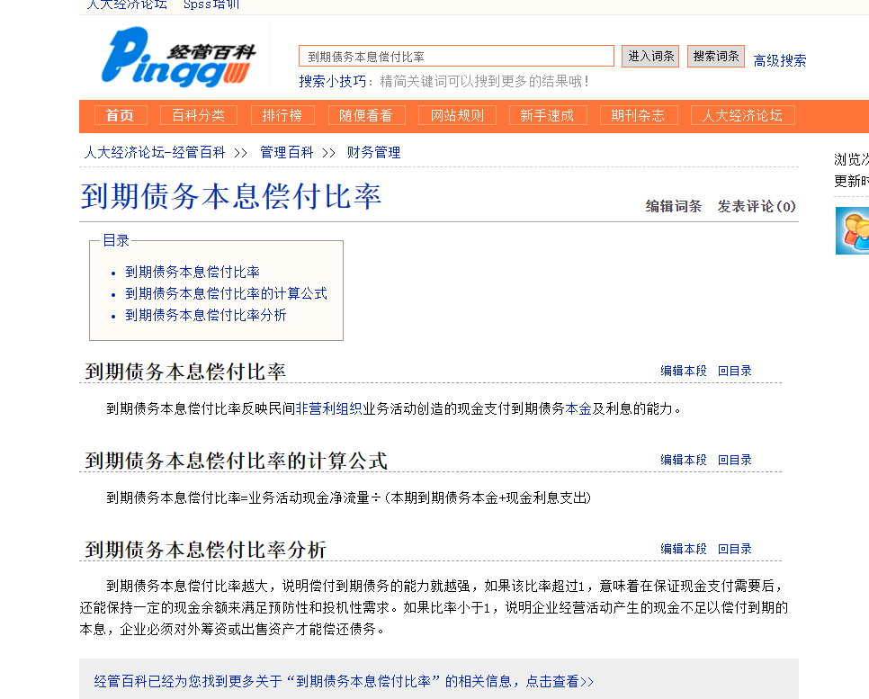

- SCIdict：www.scidict.org/

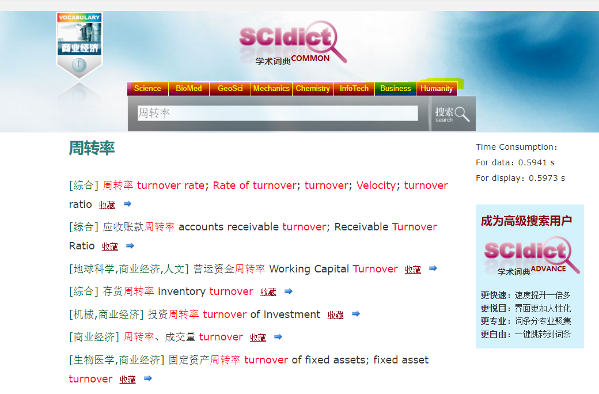
  
    专为学术研究人员以及技术专家设计的中英专业术语搜索词典,致力于为细分专业领域的翻译提供参照,并同时促进各行各业人士的专业英语学习进阶。其中包括科学、生物医学、己写、化学、信息科学、商业、人文几个领域。

    会将搜索到的所有词汇返回给使用者，使用者可以通过箭头链接跳转到相关词条查看。

    优点：双语；集成多个领域

    缺点：收费，一年269元；词条质量无法保证，搜索时出现过直译现象。

国外：

- 投资百科 investopedia：https://www.investopedia.com/financial-term-dictionary-4769738

    1999年创立的美国网站，专注投资金融教育。网站有投资、教育、市场、金融咨询、字典等几个板块。字典板块可以查询金融词汇，通过字母索引检索。同时会在字典首页推送金融方向的每日1词。每个词条除了解释还会包括如何理解、词汇辨析、局限性、举例等等内容，为使用者带来很大便利。

    优点：免费；词条全面；解释详细；界面清晰；较权威

    缺点：并没有找到如何添加词条的途径

- Herold Financial Dictionary ：https://www.financial-dictionary.info/
  
  Herald金融在线词典，拥有Accounting, Banking, Corporate Finance, Economics, Investments Laws & Regulations, Real Estate, Retirement, Trading几个板块，此外可通过字母索引进行搜索，或者直接查看所有词条。另外，还可以检索英文简写，例如：ARM--Adjustable Rate Mortgage
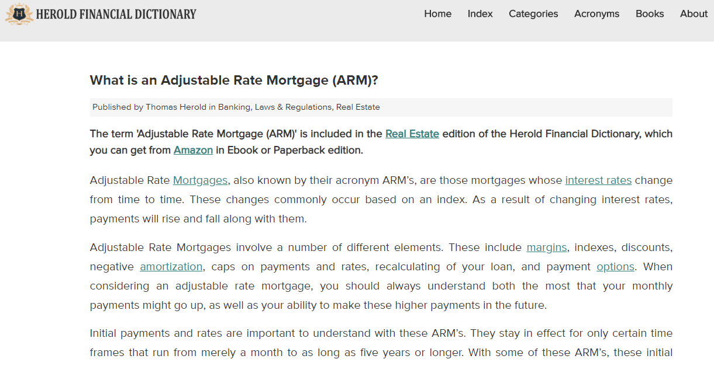
  Herald Dictionary 同时拥有纸质版本，分为Basic Edition, Accounting, Banking, Corporate Finance, Economics, Investments, Laws&Regulations, Real Estate, Retirement, Trading几本，可以在亚马逊购买。
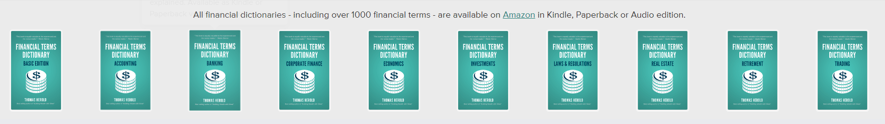
  优点：免费；界面简洁清晰；索引清晰；词条解释详细

  缺点：词条较少；主要还是一个纸质版本的节选

- 牛津金融与银行词典 Dictionary of Finance and Banking：https://www.oxfordreference.com/view/10.1093/acref/9780199229741.001.0001/acref-9780199229741
  
    纸质版牛津金融与银行词典的线上版本，以字母索引。

    优点：老牌权威；索引清晰；收录多，条目全；

    缺点：收费，需要订阅
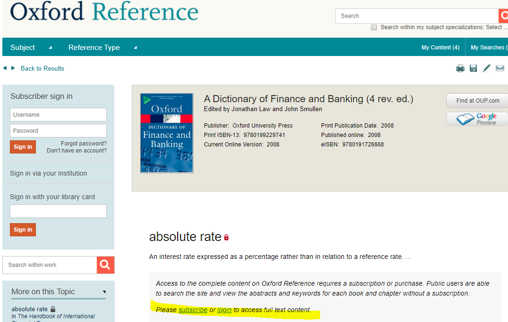

- Investing Answers https://investinganswers.com/financial-dictionary

    一个金融咨询网站，提供金融方面的服务。但同时也提供投资、贷款、信用卡、抵押、银行、保险等相关的术语词汇解释。同时可以看出每一个标题下包含多少个条目。

    优点：免费；权威性较高；集成多个领域；界面清晰；搜索结果清晰、有自己的逻辑，还有举例说明
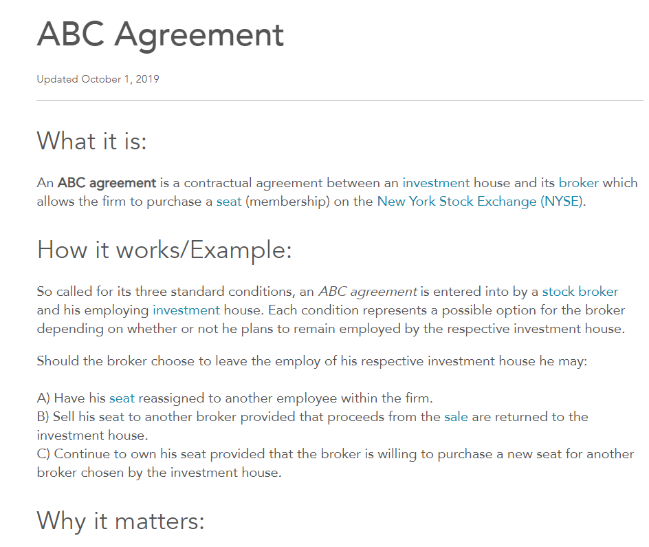

    缺点：条目仅仅按字母罗列，不便于搜索

- wall street oasis： https://www.wallstreetoasis.com/finance-dictionary

    WSO是一个全球的金融社区，共参与者交流、提供服务。网站自称“ hope to be one of the most comprehensive financial dictionaries on the web”现收录400多条金融、贸易、投资相关词汇。使用者可以通过发邮件向网站管理者请求即使更新条目。字母索引方式排列。

    优点：免费；专人筛选，权威性高；搜索结果会推荐县官条目
    
    缺点：条目内容较为简短；实际内容收录并不是很多

- http://www.finance-glossary.com/
  
  一个简单的金融词汇平台，只能根据字母索引和搜索框查询。用户可以通过填写自己的专业和想增加的内容进行申请。

  优点：简介，直奔主题
  
  缺点：条目少，解释简短，仅仅使用原始的表格形式维护。
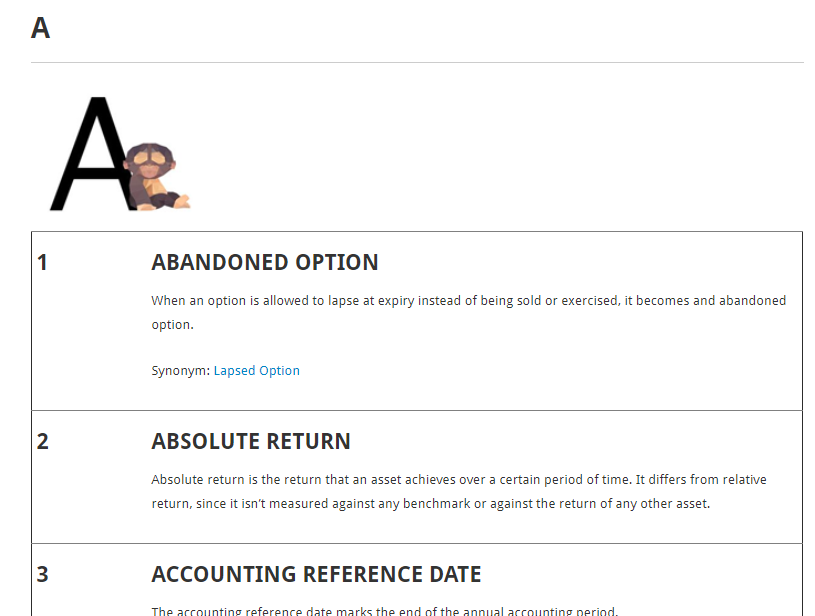

**纸质词典**

1. 巴伦商业词典 Barron's Business Dictionaries
- Dictionary of Business and Economics Terms
- Dictionary of Real Estate Terms
- Dictionary of Accounting Terms 
- Dictionary of Banking Terms
- Dictionary of Finance and Investment Terms
- Dictionary of Insurance Terms 
  
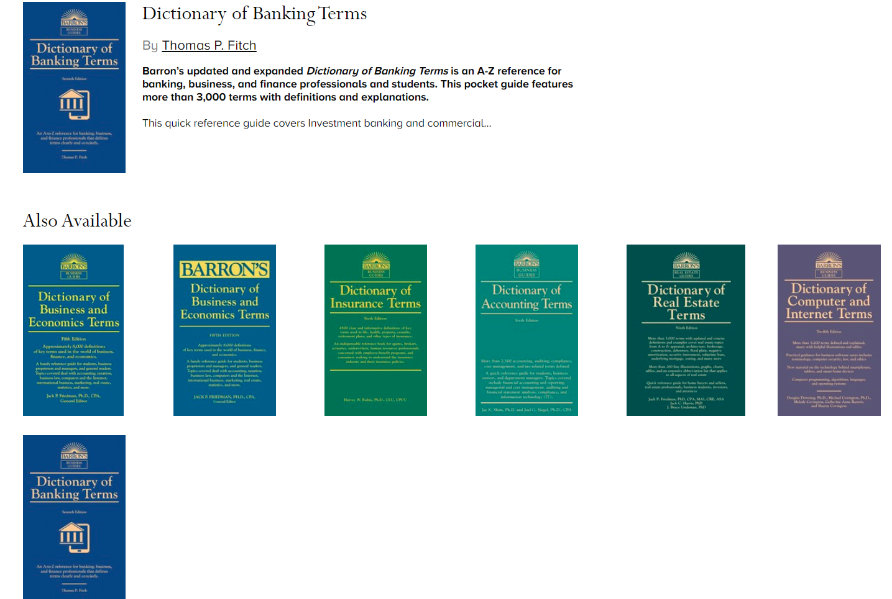

1. 高盛银行财经词典
2. 英汉路透金融词典

举例：
“We are seeing _safe-haven_ demand rise at the same time as risk assets look well supported. The risk-on, risk-off pendulum is broken, or at least is swinging to a different beat. ”
——https://www.investorschronicle.co.uk/risk/2019/07/18/finding-safe-haven/

safe haven其实是一个比较常用的金融词汇，一般词典都能查到，在这里比较一下区别，比如说在剑桥词典中：

很清晰解释了这个词的涵义，就是在其他投资贬值的时候买的用来保值的东西。
但对比investopedia专业词典的解释

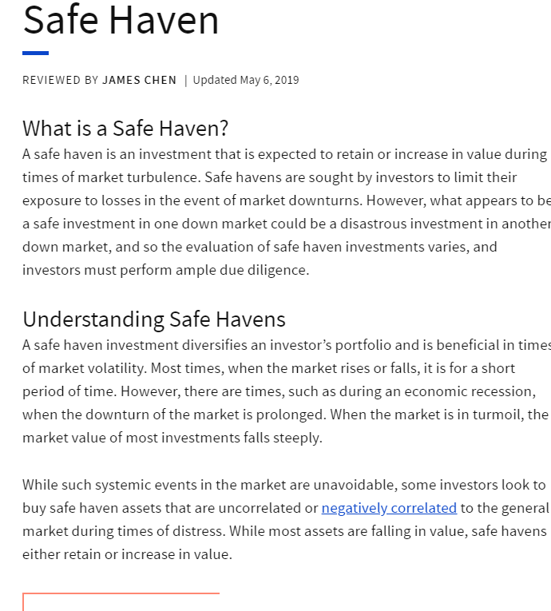

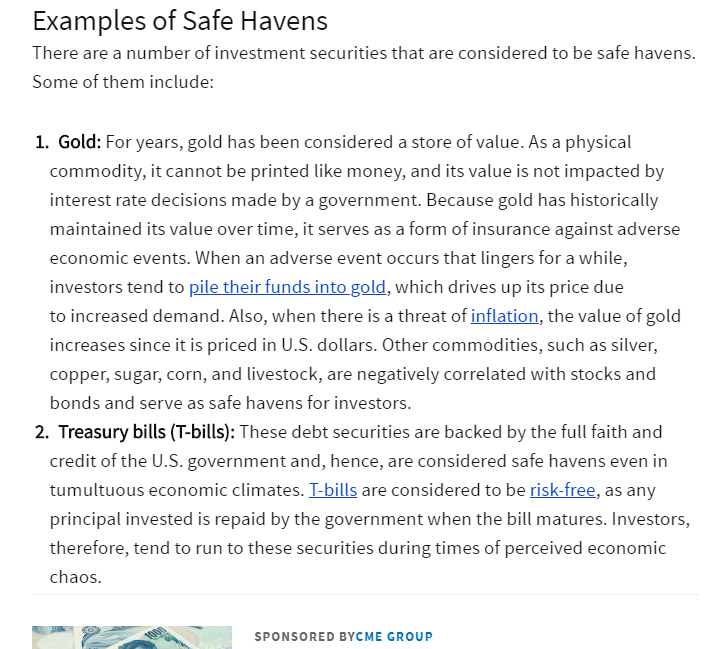

拥有What is a Safe Haven?Understanding Safe Havens；Examples of Safe Havens；Safe Haven Currencies；Considerations When Searching for Safe Havens 好几个模块。

### 法律方向

国内：

- 元照英美法词典-app，可以在欧陆词典中下载使用：English-Chinese Dictionary of Anglo-American Law

    集成潘汉典教授等学者组织编写法律出版社出版的《元照英美法辞典》纸质版。编译者权威，同游5万余词条。词条注明了词源和用法

    优点：双语；专家修订、权威；词条丰富；英到中解释全面

    缺点：英到中解释详细，但相比中到英翻译解释太短，一般只有词的翻译

- 布莱克法律大辞典-app：https://thelawdictionary.org/
    这个网站并不是官方网站，但基于布莱克法律大辞典第二版（由于其版权已经过期，可以公共访问），但使用者可以通过联系管理人员申请增加词条。现在收录30000条以上相关词汇。

    优点：权威性高；拥有移动版本；搜索结果包含词条来源
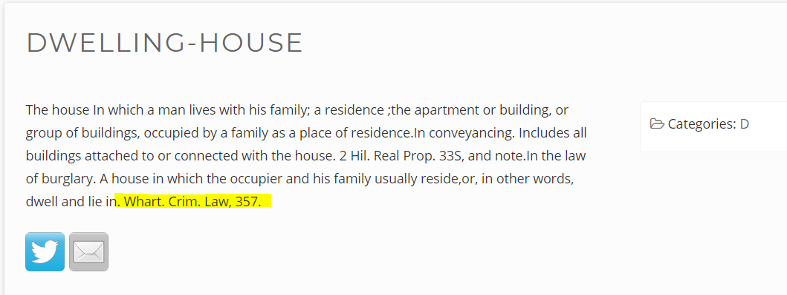
    缺点：界面不清晰，入口难找，搜索框在最下；词条解释较短

- 韦氏法律词典： https://www.merriam-webster.com/legal
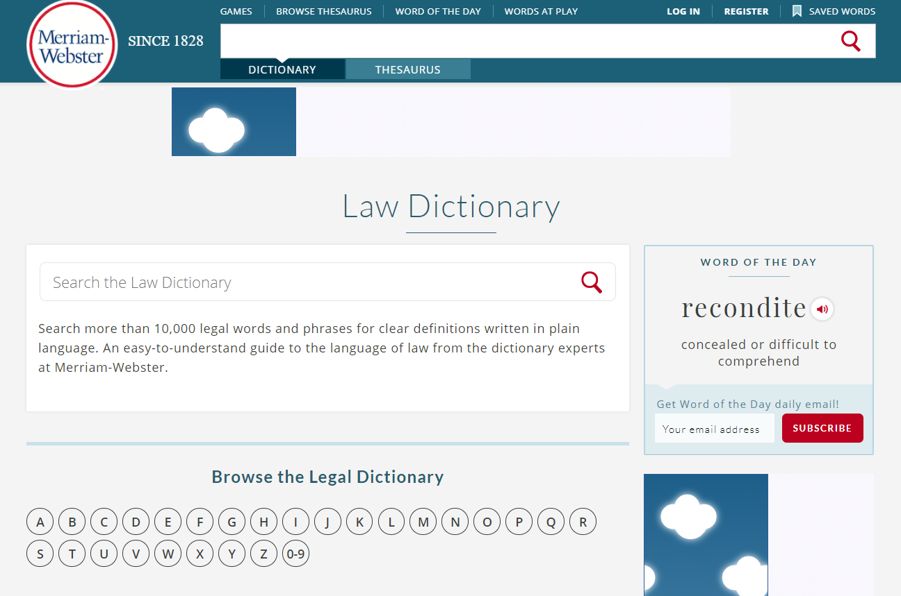
    收录超过10000个法律词汇，拥有清晰、简洁的解释，词条由韦氏词典编撰的专业人士筛选。此外，韦氏词典的网页版会根据查询词汇的不同有各种链出，例如：比较相似词汇、像韦氏其他词典链接以获得更详细解释，方便用户对查询词汇更深的理解。

    优点：免费；界面简洁，并可以同时看到在普通韦氏词典中的词条解释；词条全面；老牌权威；每个词不同的相关链接

    缺点：每个词条的解释较少

- 牛津法律词典：https://www.oxfordreference.com/view/10.1093/acref/9780199551248.001.0001/acref-9780199551248
  
  牛津法律网络词典2013修订版，收录了4200个法律词条。被誉为the best law dictionary’ and ‘excellent for non-law students as well as law undergraduates’。通过字母索引组织，此外词条解释还包括词条来源信息。
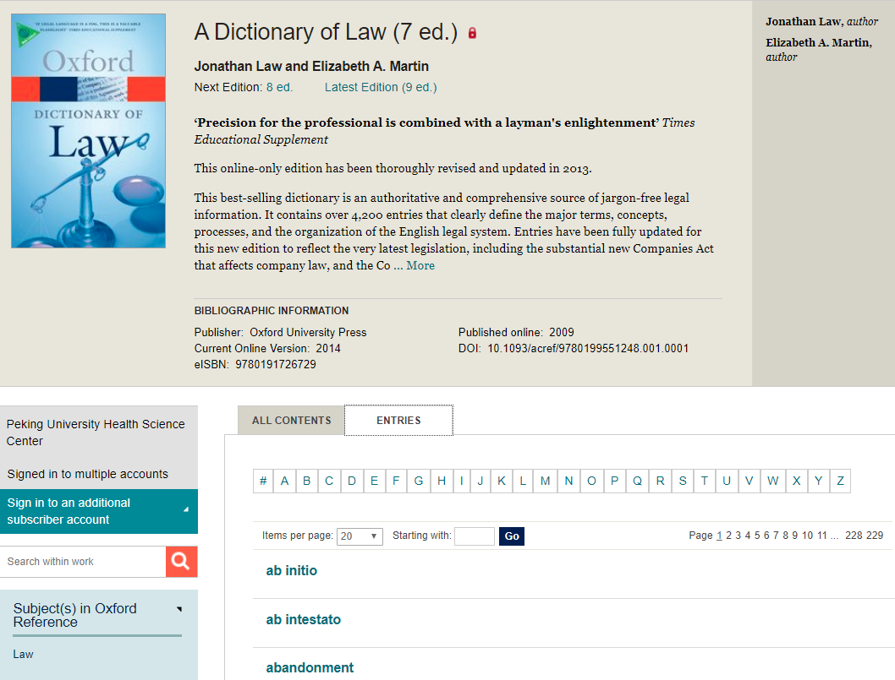
    优点：老牌权威；词条全面；界面清晰
    缺点：收费，需要订阅

- https://dictionary.law.com/
  
  一个法律咨询网站，提供律所推荐等法律服务。词典是支持的服务之一，使用字母索引。

  优点：界面简介清晰

  缺点：词条较少；解释较少
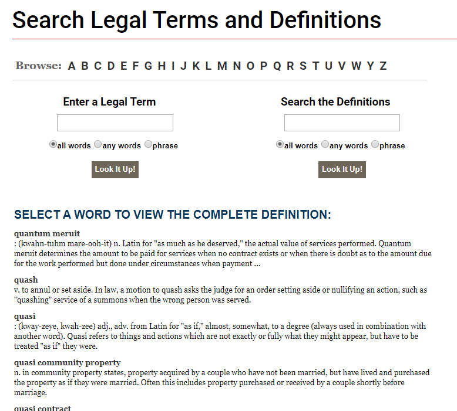

举例：

"A person placing his signature upon an _instrument_ other- wise than as _maker,_ drawer or acceptor, is deemed to be an indorser unless he clearly indicates by appropriate words his intention to be bound in some other capacity."——
Washington University Law Review, *Liability of Accommodation Indorser*

这里的instrument和maker都是平常最常见的单词，但是像乐器和制造者这种翻译在这里一看就不适用，首先尝试查找非专业领域在线词典，这里选取剑桥和科林斯词典两个网站：

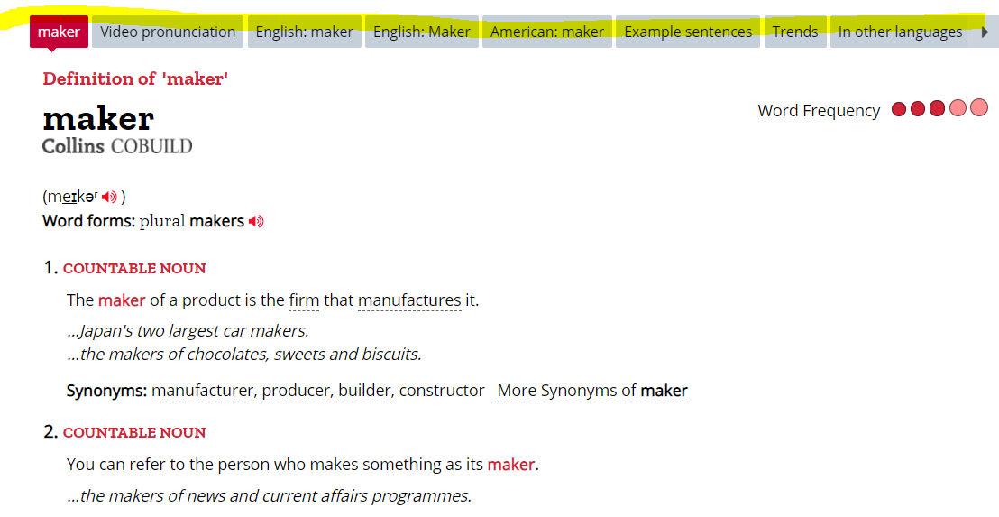

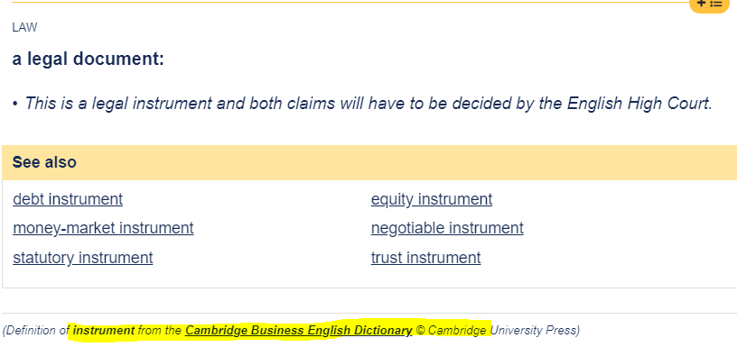

可以看到科林斯词典是从不同语言对这个词的理解出发建的词条；而剑桥词典中确实能找到在法律当中的用法，但是因为法律词条被排在很下面所以很不方便使用，而maker一词又完全找不到相关的解释，说明法律意义收录的并不完善。

接着查找法律专业词典，这里用韦氏和元照词典举例：
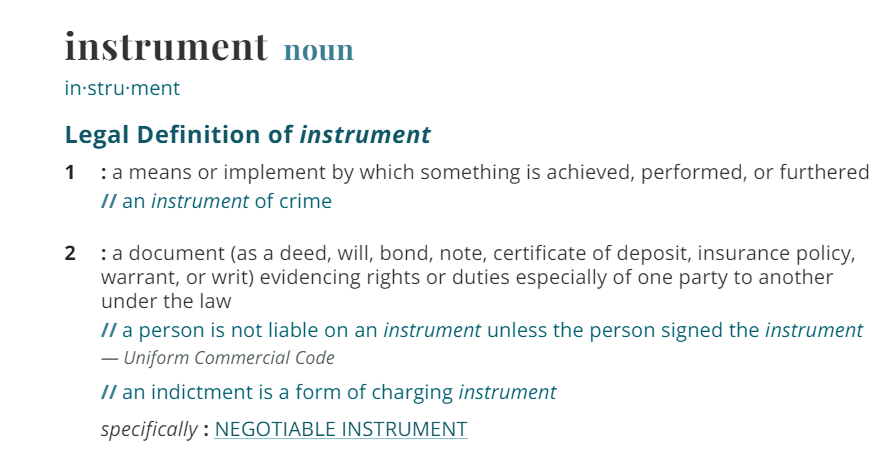
元照
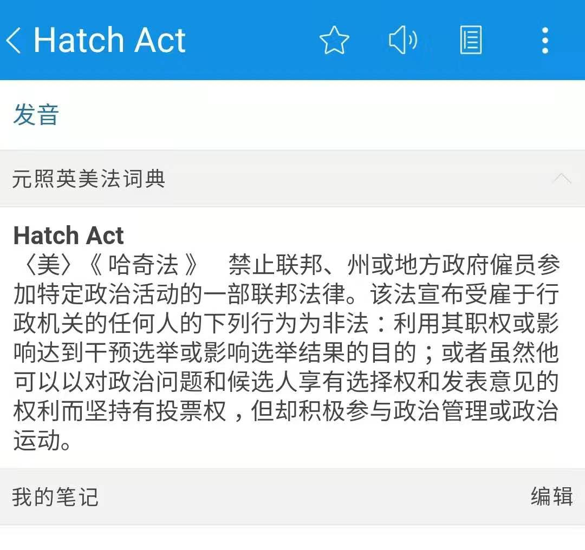
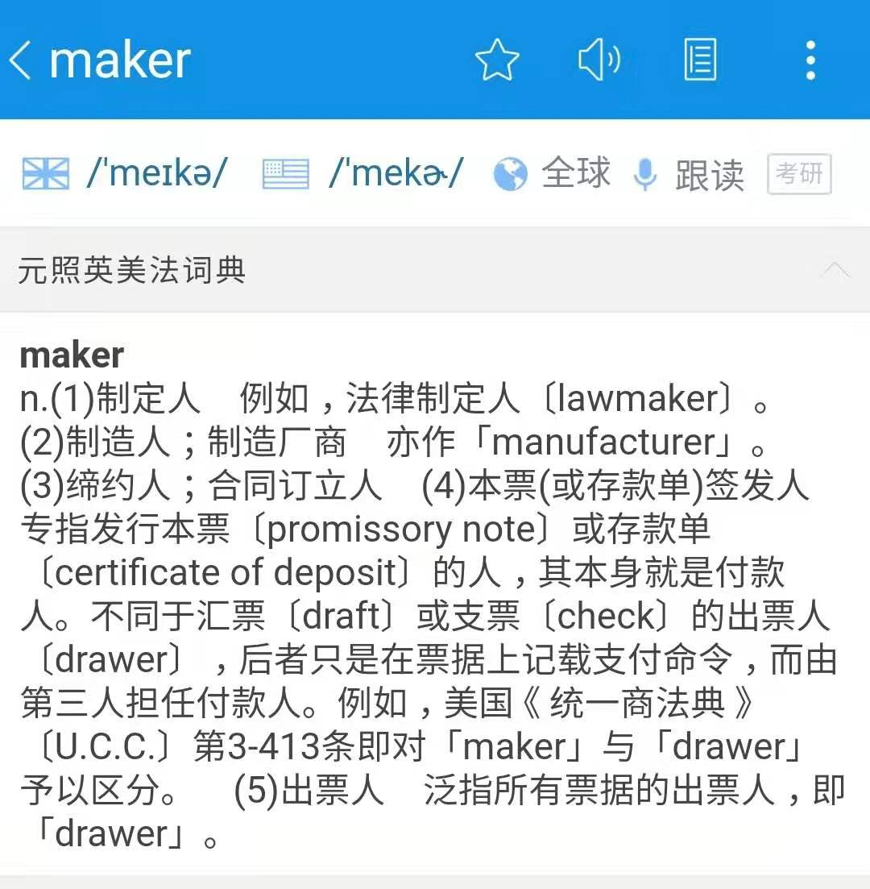
可以很清楚的看出该词在法律领域的用法和来源。

